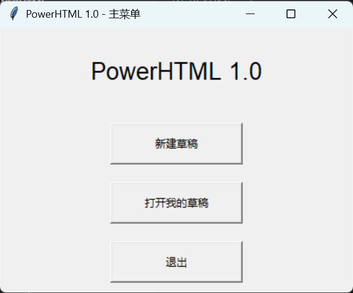
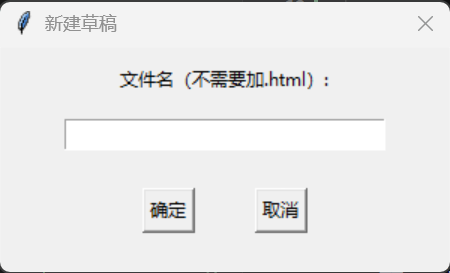
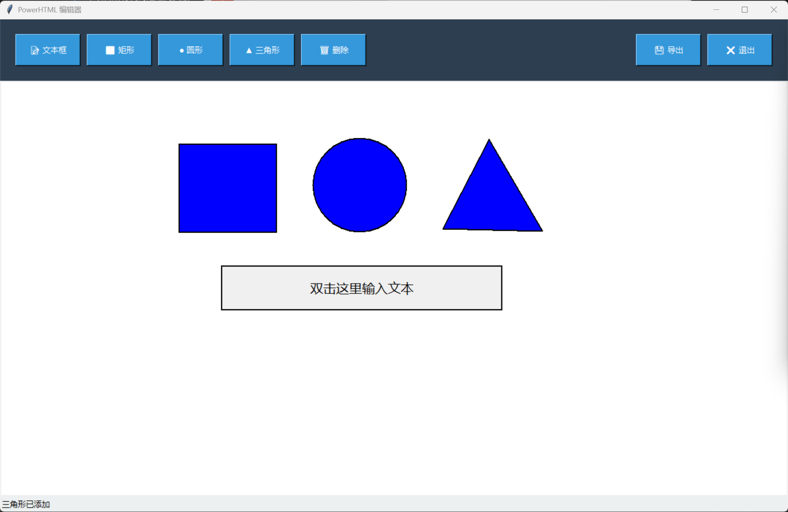
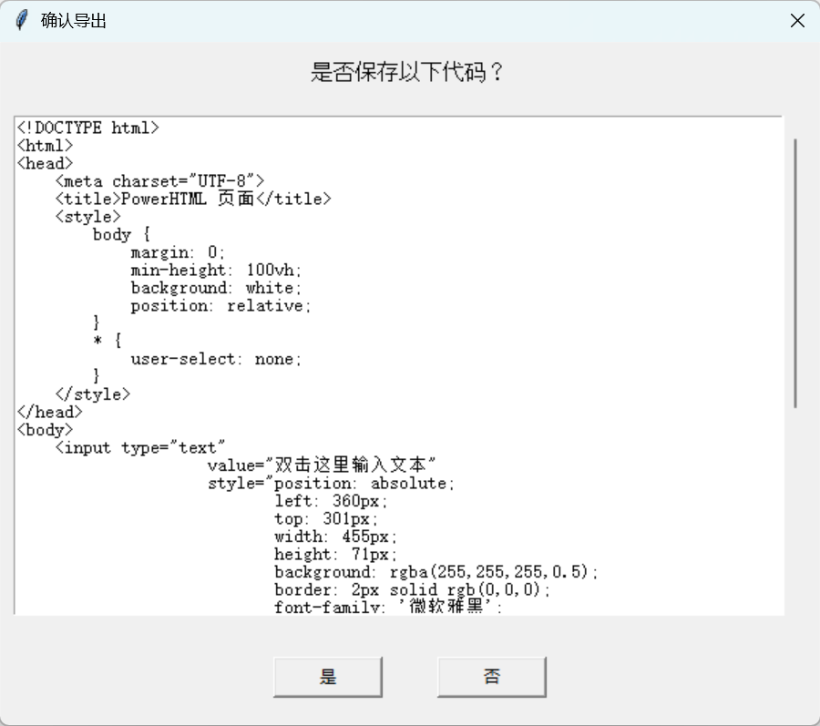
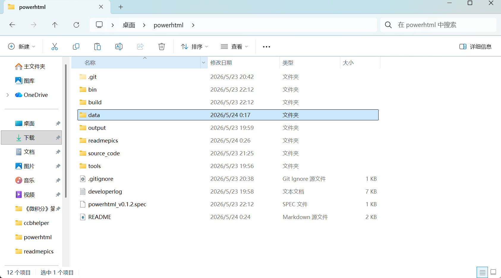
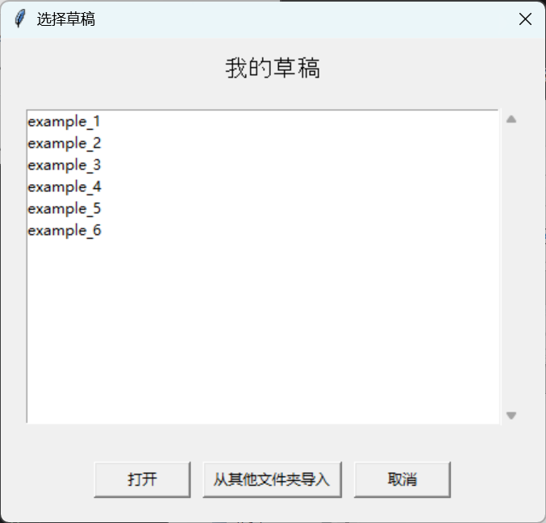

# PowerHTML v0.1.2 测试版本

## 项目介绍

本项目通过类似于编辑 PPT 或 PPTX 的方式来可视化编辑网页内容，并输出 HTML 和 JSON 代码。

本项目致力于帮助对开发网站有意愿但不愿意学习 HTML、CSS、JavaScript 编程语言的非程序员了解并开发网站。

> 本项目所有代码通过网页版 DeepSeek AI 生成
> 网址：https://chat.deepseek.com/

---

## 项目功能

### 主菜单界面

### 新建草稿

输入文件名，点击确定，开始编辑。

---

## 支持的图形类型（v0.1.2）

| 图形 | 操作说明 |
|------|----------|
| 📝 文本框 | 点击工具栏「文本框」按钮 → 在画布上拖动鼠标确定大小 → 双击文本框可编辑文字 |
| ⬛ 矩形 | 点击工具栏「矩形」按钮 → 在画布上拖动鼠标确定矩形大小 |
| ● 圆形 | 点击工具栏「圆形」按钮 → 拖动鼠标确定圆心和半径（或点击两次：第一次圆心，第二次边界点） |
| ▲ 三角形 | 点击工具栏「三角形」按钮 → 在画布上依次点击三次，确定三个顶点 |

### 编辑界面示例

**操作说明：**

- 选中图形：单击图形，图形会显示蓝色关键点
- 移动图形：选中图形后，按住并拖拽即可移动位置
- 编辑文字：双击文本框，输入文字后按回车确认
- 删除图形：选中图形后，按键盘 Delete 键
- 保存草稿：关闭编辑器时选择「是」
- 放弃修改：关闭编辑器时选择「否」

---

## 导出与保存

程序后台会在你编辑页面的时候自动生成相应的 HTML 代码。

点击「导出」可以查看生成的 HTML 代码，或点击「退出」保存代码。

---

## 重新编辑草稿

你可以通过「打开我的草稿」重新找到以前的草稿再次编辑，或到 `data` 文件夹中查看代码。

---

## 本地预览

到 `data` 文件夹中找到你的项目，用浏览器打开 HTML 文件，即可在本地浏览你开发的网页。

> 你的草稿默认保存在 `data` 文件夹中。

---

## 如何将网页分享给朋友？（本地 → .com 网站）

目前你的网站还仅能在本地浏览。想把自己制作的网站分享给朋友们吗？以下是几种方法：

### 方法一：使用 GitHub Pages（免费，推荐）

| 步骤 | 操作 |
|------|------|
| 1 | 注册 GitHub 账号（https://github.com） |
| 2 | 点击「New repository」创建新仓库 |
| 3 | 仓库名填写 `你的用户名.github.io` |
| 4 | 将你的 `example.html` 重命名为 `index.html` |
| 5 | 上传 `index.html` 到仓库 |
| 6 | 等待 1-2 分钟，访问 `https://你的用户名.github.io` 即可 |

### 方法二：使用 Vercel（免费，更简单）

| 步骤 | 操作 |
|------|------|
| 1 | 注册 Vercel 账号（https://vercel.com） |
| 2 | 点击「Drag and drop」上传你的 HTML 文件夹 |
| 3 | 系统自动部署，几秒后生成网址 |
| 4 | 复制网址分享给朋友 |

### 方法三：使用 Netlify（免费）

| 步骤 | 操作 |
|------|------|
| 1 | 注册 Netlify 账号（https://netlify.com） |
| 2 | 将你的 HTML 文件夹拖拽到浏览器窗口 |
| 3 | 自动生成 `https://随机名称.netlify.app` 网址 |
| 4 | 可自定义域名或修改随机名称 |

### 方法四：购买域名 + 虚拟主机（付费，专业级）

| 步骤 | 操作 |
|------|------|
| 1 | 购买域名（阿里云、腾讯云、GoDaddy 等，约 ¥30-60/年） |
| 2 | 购买虚拟主机（约 ¥100-300/年） |
| 3 | 通过 FTP 上传你的 HTML 文件 |
| 4 | 绑定域名，即可通过 `.com` 访问 |

---

## 项目结构

POWERHTML/ # 项目根目录
│
├── bin/ # 编译输出目录
│ ├── data/ # ⚠️ 错误放置的草稿文件夹（应位于根目录）
│ └── powerhtml_v0.1.2.exe # 可执行文件（无需 Python 环境）
│
├── build/ # PyInstaller 临时编译文件（可忽略）
│
├── data/ # ✅ 用户草稿存储目录（正确位置）
│ └── 你的草稿名称/ # 每个草稿独立文件夹
│ ├── 草稿名.html # 原始 HTML 文件
│ ├── temp_草稿名.html # 临时 HTML 文件（编辑中）
│ ├── shapes.json # 原始图形数据
│ ├── temp_shapes.json # 临时图形数据（编辑中）
│ └── img/ # 图片文件夹（预留）
│
├── output/ # 输出目录（预留）
│
├── readmepics/ # README 文档配图目录
│
├── source_code/ # 源代码目录
│ │
│ ├── powerhtml.py # 主程序入口（相当于 main.py）
│ │
│ ├── core/ # 核心逻辑模块
│ │ ├── init.py # 模块初始化
│ │ ├── project.py # 项目管理（新建/打开/保存草稿）
│ │ └── renderer.py # 画布渲染器（绘制图形）
│ │
│ ├── shapes/ # 图形类模块
│ │ ├── init.py # 模块初始化，导出所有图形类
│ │ ├── shape.py # 图形基类（Shape）
│ │ ├── rect.py # 矩形类（Rect）
│ │ ├── circle.py # 圆形类（Circle）
│ │ ├── triangle.py # 三角形类（Triangle）
│ │ └── textbox.py # 文本框类（TextBox）
│ │
│ ├── ui/ # 用户界面模块
│ │ ├── init.py # 模块初始化，导出 UI 类
│ │ ├── main_menu.py # 主菜单窗口
│ │ ├── editor.py # 编辑器窗口（核心交互）
│ │ └── dialogs.py # 通用对话框（新建/打开/导出确认）
│ │
│ └── utils/ # 工具函数模块
│ ├── init.py # 模块初始化
│ └── helpers.py # 辅助函数（颜色转换、坐标计算等）
│
├── tools/ # 外部工具目录（预留）
│
├── .gitignore # Git 忽略文件配置
├── developerl.txt # 开发日志
├── powerhtml_v0.1.2.spec # PyInstaller 配置文件
└── README.md # 项目说明文档

### 核心文件说明

| 文件 | 作用 |
|------|------|
| `powerhtml.py` | 程序入口，启动主菜单 |
| `core/project.py` | 管理草稿的创建、打开、保存、导入 |
| `core/renderer.py` | 在画布上绘制图形和关键点 |
| `shapes/shape.py` | 定义所有图形的基类 |
| `shapes/rect.py` | 矩形类，包含绘制、移动、碰撞检测 |
| `shapes/circle.py` | 圆形类，包含绘制、移动、碰撞检测 |
| `shapes/triangle.py` | 三角形类，包含绘制、移动、碰撞检测 |
| `shapes/textbox.py` | 文本框类，包含绘制、移动、文字编辑 |
| `ui/main_menu.py` | 主菜单界面（新建/打开/退出） |
| `ui/editor.py` | 编辑器界面（绘制、编辑、保存） |
| `ui/dialogs.py` | 通用对话框（确认框、输入框） |
| `utils/helpers.py` | 颜色转换、坐标计算等工具函数 |

### ⚠️ 注意事项

- `bin/data/` 是编译时错误生成的文件夹，正常草稿应位于根目录的 `data/` 中
- `__pycache__/` 是 Python 自动生成的缓存文件夹，可忽略
- `build/` 和 `*.spec` 是 PyInstaller 编译产物，可删除

---

## 常见问题及解决方案

1. 由powerhtml.py编译后生成的exe文件识别不到原来的data草稿
- 解释：编译后的exe文件的根目录可能发生改变，只能识别当前根目录下的data文件夹中的草稿
- 解决方案：重新建data文件夹进行编辑，或者将原来的data文件夹移动到当前根目录下
2. 从其他文件夹导入草稿变成空白
- 解释：当前的导入草稿导入的是html文件，而不是文件夹，导致只能导入html而无法导入json
- 解决方案：没办法，等我（AI）写下个版本吧

---

## ⚠️ 风险说明

本项目为 **Vibe Coding 实验性项目**，代码完全由 AI（DeepSeek）生成，未经完整测试与安全审计，使用前请知悉以下潜在风险：

### 1. 稳定性风险
- 部分功能可能存在未预期的 Bug，如图形渲染异常、拖拽偏移、保存失败等
- 建议频繁手动备份 `data` 文件夹中的 JSON 和 HTML 文件

### 2. 兼容性风险
- 项目仅在现代桌面浏览器（Chrome / Edge / Firefox 最新版）中进行过基本测试
- **移动端设备、旧版浏览器、Safari 可能存在显示或交互异常**

### 3. 数据安全风险
- 所有草稿默认保存在本地 `data` 文件夹，**无云备份功能**
- 清除浏览器缓存、卸载程序或磁盘故障可能导致数据丢失
- 请勿用于存储任何敏感或个人隐私信息（估计也没人会这么干）

### 4. 代码质量风险
- 作为 Vibe Coding 产物，代码结构可能存在冗余、命名不规范、性能低下等问题
- **不适合直接作为生产环境项目的基础**，如需二次开发，建议重构核心模块

### 5. 导出 HTML 的注意事项
- 导出的 HTML 文件依赖内联样式和脚本，**未针对 XSS 等安全漏洞进行防护**（事实上，README也是AI生成的，作者根本不知道什么是XSS）
- 不要直接嵌入不可信的用户输入内容
- 如用于公开网站，建议额外添加内容安全策略（CSP）

### 6. 维护与支持
- 本项目无持续维护承诺，Bug 修复依赖社区或用户自行解决
- 不提供 7×24 技术支持

### ✅ 使用建议
| 场景 | 是否推荐 |
|------|----------|
| 个人学习、快速原型演示 | ✅ 可使用 |
| 商业项目、生产环境部署 | ❌ 不推荐 |(这破玩意估计也没人用)
| 存储重要数据 | ❌ 不推荐 |
| 给完全不懂代码的朋友体验 | ✅ 可使用 |

> 使用本软件即表示您已阅读并接受上述风险。如有疑问，欢迎反馈。

---

## 版本信息

| 版本 | 日期 | 说明 |
|------|------|------|
| v0.1.2 | 2026/5/24 | 测试版本：支持文本框、矩形、圆形、三角形；支持文字编辑、拖拽移动、删除 |

---

## 项目链接

- DeepSeek AI：https://chat.deepseek.com/
- 项目 GitHub：（待补充）

---

> 祝你使用愉快！如有问题，欢迎反馈至gnlhgxqddtx@sjtu.edu.cn（骗你的，这邮箱我平时根本不看）。

---

## 备注

> 我是大一在读的软件工程专业学生，编程经验极浅，一开始看到网上的一个话题：AI可以让不懂编程的普通人开发网站项目吗？
> 我认为，到目前为止，普通人利用AI能开发的所谓网站项目都有两个缺点：
- 修改维护极度依赖AI，一个细微的改动可能需要重新写提示词，重新让AI输出、复制、粘贴、调试
- 仅能制作本地的localhost8000之类的项目，缺少远程服务器
> 我希望能够简化网站的开发过程，编写一个能让大家像做ppt一样开发网站的项目，同时保留开发网站本身的DIY乐趣。
> 希望以后这个项目能让普通人直接开发出自己的网站。远程服务器我还没法提供，等我多学一些或者多掌握一些资源的时候再解决吧
